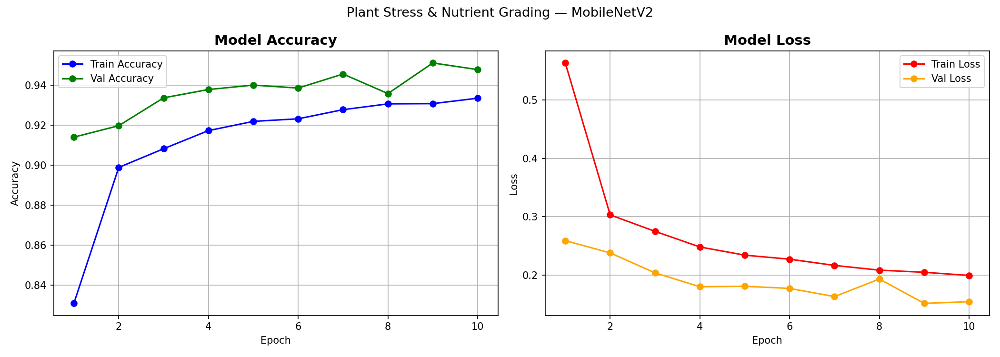
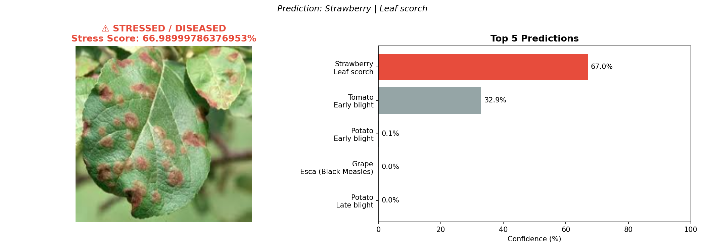

# 🌱 Plant Stress & Nutrient Grading System

A deep learning pipeline that detects plant diseases and stress levels 
from a single leaf photo using MobileNetV2 transfer learning.

## 📊 Results
| Metric | Value |
|--------|-------|
| Validation Accuracy | **95.11%** |
| Dataset | PlantVillage (54,000+ images) |
| Classes | 38 (diseases + healthy) |
| Architecture | MobileNetV2 (Transfer Learning) |

## 🔧 Tech Stack
- **Model:** MobileNetV2 (pretrained on ImageNet, frozen base)
- **Preprocessing:** OpenCV — Gaussian denoising, HSV conversion, Histogram equalization
- **Framework:** TensorFlow + Keras
- **Dataset:** [PlantVillage (Kaggle)](https://www.kaggle.com/datasets/abdallahalidev/plantvillage-dataset)
- **Platform:** Google Colab (T4 GPU)

## 🧪 Test Results
| Test Image | Prediction | Confidence | Status |
|------------|------------|------------|--------|
| Potato leaf | Late Blight | 96.54% | ⚠️ Diseased |
| Corn leaf | Healthy | 92.60% | ✅ Healthy |

## 🧠 Pipeline
Leaf Image → OpenCV Preprocessing → MobileNetV2 → Stress Score + Disease Class

## 📈 Training Curves

## 🎯 Demo Output

## 🚀 How to Run
1. Open `Plant_Stress_Nutrient_Grading.ipynb` in Google Colab
2. Enable T4 GPU (Runtime → Change runtime type → T4 GPU)
3. Run all cells sequentially
4. Upload any leaf image when prompted

## 👩‍💻 Author
**Swara Nisal**  
2nd Year B.Tech CSE — SVPCET Nagpur
